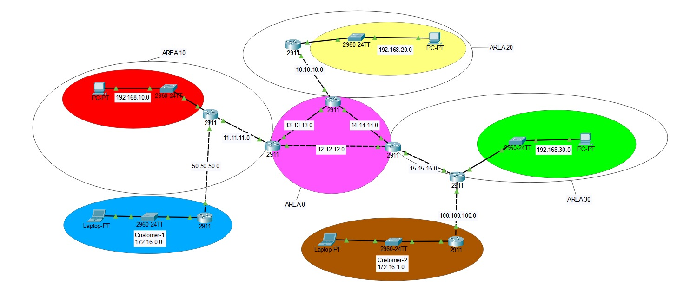

# 🧠 Multi-Area OSPF Lab with Static Route Redistribution

This Packet Tracer lab simulates an enterprise network using multi-area OSPF routing, with external customer networks connected via static routes. Static routes from customer edge routers are redistributed into OSPF by the core routers, enabling full end-to-end IP connectivity between internal departments and external zones.

## 🌐 Topology Overview

- Core Backbone (Area 0): A triangle mesh of 3 routers acting as the OSPF backbone.
- OSPF Areas:
  - Area 10 – Subnet: 192.168.10.0/24
  - Area 20 – Subnet: 192.168.20.0/24
  - Area 30 – Subnet: 192.168.30.0/24
- Customer Networks:
  - Customer 1 (Blue) – Subnet: 50.50.50.0/24 (uses static routing)
  - Customer 2 (Brown) – Subnet: 100.100.100.0/24 (uses static routing)
- Routing Behavior:
  - Customer routers use static routes only
  - The core routers connected to the customers redistribute static routes into OSPF using:
    router ospf 1  
    redistribute static subnets

## 🧩 Key Features

- Multi-Area OSPF Design (Areas 0, 10, 20, 30)
- Static Routing on Customer Routers
- Static Route Redistribution into OSPF
- End-to-end connectivity across all areas and customer networks

## 🖼️ Topology Diagram

## 📁 Files Included

- ospf-multi-area-lab.pkt – Main Packet Tracer file
- README.md – Documentation and overview
- topology.png – Topology diagram image

## 💡 Notes

- OSPF configuration includes backbone and non-backbone areas for modular routing
- No OSPF is configured on the customer routers — only static routing
- All inter-area communication is handled via ABRs connected to Area 0

## 📌 Author
Rani Kamaleddine

[GitHub Profile](https://github.com/r4n1-exe)

[LinkedIn](https://www.linkedin.com/in/rani-kamaleddine)
